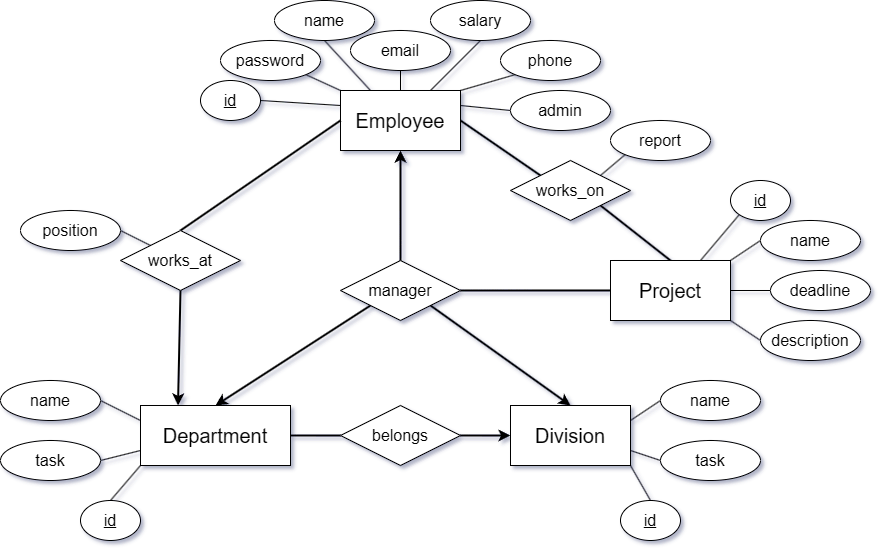

Egy vállalati nyilvántartó rendszerben tárolják a cég dolgozóinak, osztályainak,
részlegeinek és projektjeinek adatait. Az új dolgozóknak regisztrálniuk kell a
rendszerbe, majd bejelentkezés után használhatják azt. Az adminok aktualizálhatják az
adatokat, a többi dolgozó csak megtekintheti azokat, és beszámolót írhat azon
projektekhez, amelyekben részt vesz vagy vett.

# Egyed-kapcsolat modell

\noindent\rule{\textwidth}{0.4pt}

Az `Employee` egyednek az `id` (céges azonosító) lesz a kulcs attribútuma. 
A `Department` (részleg), `Division` (osztály) és `Project` egyedeknél a `name` attribútum lehetne kulcs, 
viszont el szeretném kerülni a string kulcsokat, így bevezetek hozzájuk egy `id` attribútumot, ami kulcs attribútum lesz.
Mindegyiküket a `manager` kapcsolat összeköti az `Employee` egyeddel. Mind a `Project`-nek, 
`Department`-nek és `Division`-nek csak egy darab `manager`-e lehet. egy `Employee` csak egy `Division`-nek, és csak egy
`Department`-nek lehet a `manager`-e, míg `Project`-ek közl többnek is. 
Tehát a `Division` és `Employee` között, illetve `Department` és `Employee` között a `manager` kapcsolat `1:1`-hez, a 
`Project` és `Employee` között a `manager` kapcsolat pedig `1:N`-hez. 

Az `Employee` továbbá rendelkezik egy `works_on` kapcsolattal a `Project` egyeddel, 
illetve egy `works_at` kapcsolattal a `Department` egyeddel. 
A `works_on` egy `N:M`-hez kapcsolat, mivel egy `Employee` több 
`Project`-en is dolgozhat, illetve egy `Project`-en több `Employee` is dolgozhat. 
Emellett rendelkezik egy `report` (beszámoló) attribútummal.
A `works_at` egy `1:N`-hez kapcsolat, mivel egy `Employee` csak egy `Department`-ben dolgozhat, viszont egy `Department`-ben
több `Employee` is dolgozhat. Emellett rendelkezik egy `position` (beosztás) attribútummal.

A `Department` és a `Division` között van egy `1:N` hez `belongs` kapcsolat. Egy `Department` csak egy `Division`-be tartozhat
, viszont egy `Division`-be több `Department`-is tartozhat.

# Relációs adatbázisséma

\noindent\rule{\textwidth}{0.4pt}

EMPLOYEES(\underline{id} , password, name, email, salary, phone, admin)

DEPARTMENTS(\underline{department\_id} , name, task, manager_id, division_id)

DIVISIONS(\underline{division\_id} , name, task, manager_id)

PROJECTS(\underline{project\_id} , name, deadline, description, manager_id)

WORKS_AT(\underline{employee\_id}, department_id, position)

WORKS_ON(\underline{employee\_id}, \underline{project\_id}, report)

# Normalizálás

\noindent\rule{\textwidth}{0.4pt}

# Összetett lekérdezés

\noindent\rule{\textwidth}{0.4pt}

# Megvalósítás, funkciók

\noindent\rule{\textwidth}{0.4pt}