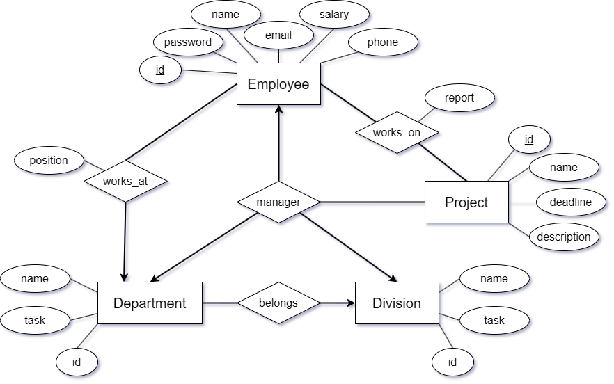

---
header-includes:
  - \usepackage{fancyhdr}
  - \pagestyle{fancy}
  - \fancyhf{}
  - \fancyhead[R]{\textbf{Név: Balog Benedek Zsolt \\ Neptun kód: JUDZOJ}}
  - \renewcommand{\headrulewidth}{0.4pt}
output: pdf_document
---

% **Vállalat**
% Adatbázisok kötelező feladat

Egy vállalati nyilvántartó rendszerben tárolják a cég dolgozóinak, osztályainak,
részlegeinek és projektjeinek adatait. Az új dolgozóknak regisztrálniuk kell a
rendszerbe, majd bejelentkezés után használhatják azt. Az adminok aktualizálhatják az
adatokat, a többi dolgozó csak megtekintheti azokat, és beszámolót írhat azon
projektekhez, amelyekben részt vesz vagy vett.

# Egyed-kapcsolat modell

***

A Division gyenge egyed, 

# Relációs adatbázisséma

***

# Normalizálás

***

# Összetett lekérdezés

***

# Megvalósítás, funkciók

***